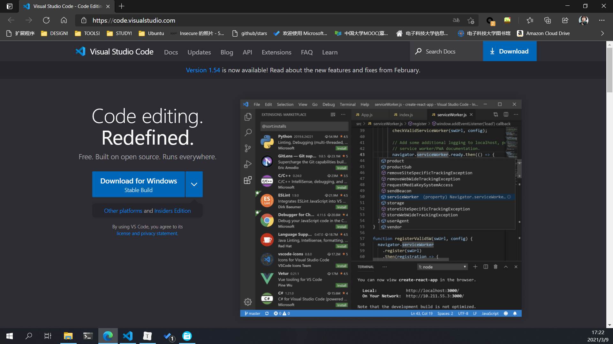
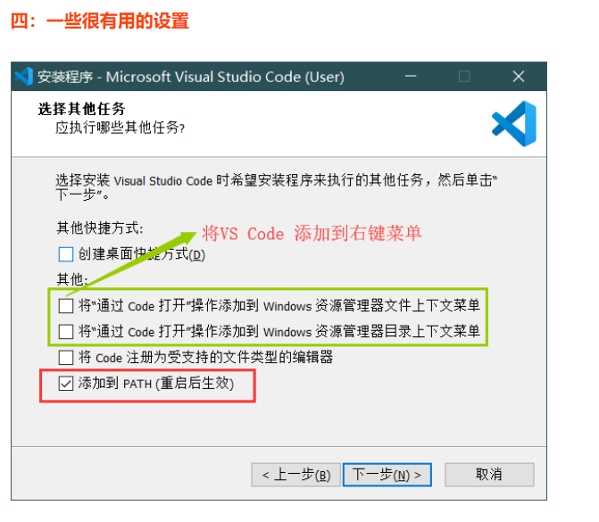

# VS Code & markmap 实现思维导图

author: zx

## 0x00 效果预览


## 0x01 准备工作

### 安装Chromium系浏览器（可选）

+ [Edge](https://www.microsoft.com/zh-cn/edge) （推荐）
+ [Chrome](https://www.google.cn/chrome/index.html)

### 安装 VS Code

[Visual Studio Code 官网](https://code.visualstudio.com/)



点击`Download`

下载并安装

[详细安装教程](https://blog.csdn.net/Zhangguohao666/article/details/105665412)



这里我会**全部**都选上

#### markmap 安装

1. 打开`VS Code` 点击左侧栏目的`扩展`或者按`Ctrl` `Shift` + `X` 打开扩展


搜索栏中搜索并安装

+ `ms-ceintl.vscode-language-pack-zh-hans` 简体中文包
+ `yzhang.markdown-all-in-one` Markdown拓展
+ `shd101wyy.markdown-preview-enhanced` Markdown拓展
+ `gera2ld.markmap-vscode` **markdown转思维导图**
+ `coenraads.bracket-pair-colorizer` 括号配对 （可选）
+ `oderwat.indent-rainbow` 缩减彩色显示 （可选）

### 安装Typora （可选）

[Typora 官网](https://typora.io)

下载并安装

## 0x02 使用教程

### markdown语法 简略版

详细指路[菜鸟教程](https://www.runoob.com/markdown/md-tutorial.html) [简书Markdown语法大全(超级版) ](https://www.jianshu.com/p/ebe52d2d468f) [Markdown语法教程](https://markdown.com.cn/) , etc.

较全面使用`markmap`**至少**掌握以下语法

**注意以下语法均使用英文符号！！！**

#### 标题

```markdown
# 一级标题
## 二级标题
### 三级标题
#### 四级标题
##### 五级标题
###### 六级标题

一级标题
===

二级标题
---
```

###### 

#### 段落

Markdown 段落没有特殊的格式，直接编写文字就好，**段落的换行是使用两个以上空格加上回车**。


当然也可以在段落后面使用一个空行来表示重新开始一个段落。


```
*斜体文本*
_斜体文本_
**粗体文本**
__粗体文本__
***粗斜体文本***
___粗斜体文本___
~~删除线文本~~
<u>下划线文本</u>

脚注 例如[^markdown]

[^markdown]: 一种标记语言

分割线

***

* * *

*****

- - -

----------

```

*斜体文本*
_斜体文本_
**粗体文本**
__粗体文本__
***粗斜体文本***
___粗斜体文本___ 
~~删除线文本~~
<u>下划线文本</u>

脚注 例如[^markdown]

[^markdown]: 一种标记语言


***

* * *

*****

- - -

----------


#### 列表

Markdown 支持有序列表和无序列表。

无序列表使用星号`*`、加号`+`或是减号`-`作为列表标记，这些标记后面要添加一个空格，然后再填写内容：

```
* 第一项
* 第二项
* 第三项

+ 第一项
+ 第二项
+ 第三项


- 第一项
- 第二项
- 第三项
```

显示结果如下：


有序列表使用数字并加上 `.`号来表示，如：

```
1. 第一项
2. 第二项
3. 第三项
```

显示结果如下：


#### 链接

链接使用方法如下：

```
[链接名称](链接地址)

或者

<链接地址>
```

例如：

```
这是一个链接 [菜鸟教程](https://www.runoob.com)
```

显示结果如下：


直接使用链接地址：

```
<https://www.runoob.com>
```

显示结果如下：


##### 高级链接

我们可以通过变量来设置一个链接，变量赋值在文档末尾进行：

```
这个链接用 1 作为网址变量 [Google][1]
这个链接用 runoob 作为网址变量 [Runoob][runoob]
然后在文档的结尾为变量赋值（网址）

  [1]: http://www.google.com/
  [runoob]: http://www.runoob.com/
```

显示结果如下：


### markmap语法

参考[Try markmap](https://markmap.js.org/repl)


```markdown
# markmap

## Links

- <https://markmap.js.org/>
- [GitHub](https://github.com/gera2ld/markmap)

## Related

- [coc-markmap](https://github.com/gera2ld/coc-markmap)
- [gatsby-remark-markmap](https://github.com/gera2ld/gatsby-remark-markmap)

## Features

- links
- **inline** ~~text~~ *styles*
- multiline
  text
- `inline code`
-
	```js
        console.log('code block');
	```
- Katex - $x = {-b \pm \sqrt{b^2-4ac} \over 2a}$
```

可以发现`markmap`还支持**行内嵌入代码** 、**代码块**、**LaTeX公式**

### 使用

#### 1 创建或打开一个文件夹

**新建文件夹** 或者 **找一个已有的文件夹**


右键点击`通过Code打开`

或者打开`VS Code` **标题栏**-**文件**-**打开文件夹**

#### 2 新建文件或打开文件


#### 3 导出

**标题栏**-**查看**-**命令面板**


搜索并点击`Open as markmap`

点击右下角`Export`即可输出`html`文件 可以用浏览器打开


